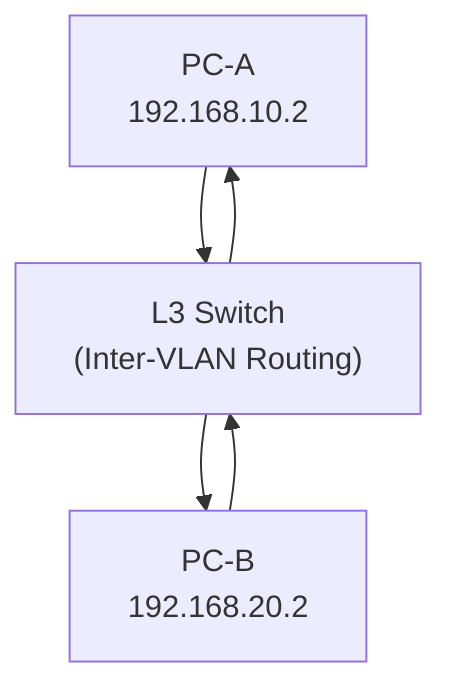

## L3 스위치

L3 스위치는 `2계층(L2: MAC 기반 스위칭)`과 `3계층(L3: IP 기반 라우팅)` 기능을 동시에 수행할 수 있는 고성능 네트워크 장비이다. 

스위치처럼 동작하지만 라우터로도 동작한다.

### 주요기능

| 기능                             | 설명                                                                 |
| -------------------------------- | -------------------------------------------------------------------- |
| 인터 VLAN 라우팅                 | 서로 다른 VLAN 간 통신을 위한 라우팅 처리                            |
| 정적/동적 라우팅 지원            | RIP, OSPF 등 라우팅 프로토콜 지원 가능                               |
| MAC 기능 포워딩 + IP 기반 라우팅 | L2 스위치처럼 MAC 주소 기반으로 빠르게 포워딩하면서 L3 라우팅도 지원 |
| 고속 처리 성능                   | ASIC 기반 하드웨어 가속으로 빠른 패킷 전달 가능                      |

### 사용 예시

- 기업 내부 네트워크에서 VLAN을 나누고, 각 VLAN 간 통신을 위한 라우팅 용도
- 데이터 센터 내에서 서보 간 내부 라우팅을 고속으로 처리할 때

---

 

## L4 로드 밸런서

L4 로드밸런서는 TCP/UDP 레벨에서의 트래픽 분산을 담당하는 로드밸런서이다. 즉 IP 주소와 포트 정보만 보고 어떤 서버로 트래픽을 보낼지 결정한다.

### 주요 기능

| 기능                     | 설명                                              |
| ------------------------ | ------------------------------------------------- |
| IP + PORT 기반 분산 처리 | 요청의 목적지 IP, 포트를 기반으로 로드밸런싱 수행 |
| 연결 추적                | 클라이언트-서버 간 세션을 추적하여 연결 유지      |
| 빠른 처리 속도           | Application Layer를 보지 않기 때문에 속도가 빠름  |
| Health Check             | 백엔드 서버의 상태 체크 후 가용한 서버만 사용     |

### 사용 예시

- TCP 기반의 HTTP, HTTPS, FTP, SMTP 요청 분산
- 클라우드 환경에서 NLB(Network Load Balancer)로 활용 (ex: AWS NLB)

---

 

## L3 Switch, L4 Load Balancer 정리

| 항목        | L3 Switch                       | L4 Load Balancer                 |
| ----------- | ------------------------------- | -------------------------------- |
| 처리 계층   | 3계층(IP)                       | 4계층 (TCP/UDP)                  |
| 주요 기능   | VLAN 라우팅, 내부망 트래픽 처리 | 외부 요청을 서버에 분산          |
| 대상        | 내부 네트워크 구성 요소         | 애플리케이션/서비스 서버         |
| 분석 범위   | IP 기반                         | IP + 포트 가반                   |
| 트래픽 방향 | 양방향 (내부 통신)              | 단방향 (클라이언트 -> 서버) 중심 |

---

 

## VLAN

VLAN은 물리적으로 같은 스위치에 연결되 있어도, 논리적으로 다른 네트워크처럼 분리하는 기술이다.

VLAN을 나누면, 같은 스위치에 연결되어 있어도 서로 통신이 되지 않는다.

> VLAN 10 -> 개발팀
> VLAN 20 -> 마케팅팀
> 두 팀의 컴퓨터가 같은 스위치에 연결되어 있어도 VLAN이 다르면 서로 핑(ping)도 안된다.

### VLAN 간 통신을 하려면?

라우팅이 필요하다.

즉 VLAN 10 에서 VLAN 20 으로 데이터를 보내려면, IP 레벨에서 경로를 계산하고 패킷을 전달해야 하는데, 이걸 `인터 VLAN 라우팅 (Inter-VLAN Routing)` 이라고 한다.

### L3 스위치가 필요한 이유

L2 스위치는 단순히 MAC 주소만 보고 프레임을 포워딩하는 반명 L3 스위치는 IP 주소를 보고 라우팅 테이블을 기반으로 경로를 계산해 줄 수있다.

| 용어             | 의미                                             |
| ---------------- | ------------------------------------------------ |
| VLAN             | 네트워크를 논리적으로 분리하여 보안 및 관리 형상 |
| 인터 VLAN 라우팅 | VLAN 간 통신을 위한 IP 기반 라우팅 처리          |
| L3 스위치        | VLAN 간 라우팅을 수행할 수 있는 장비             |
