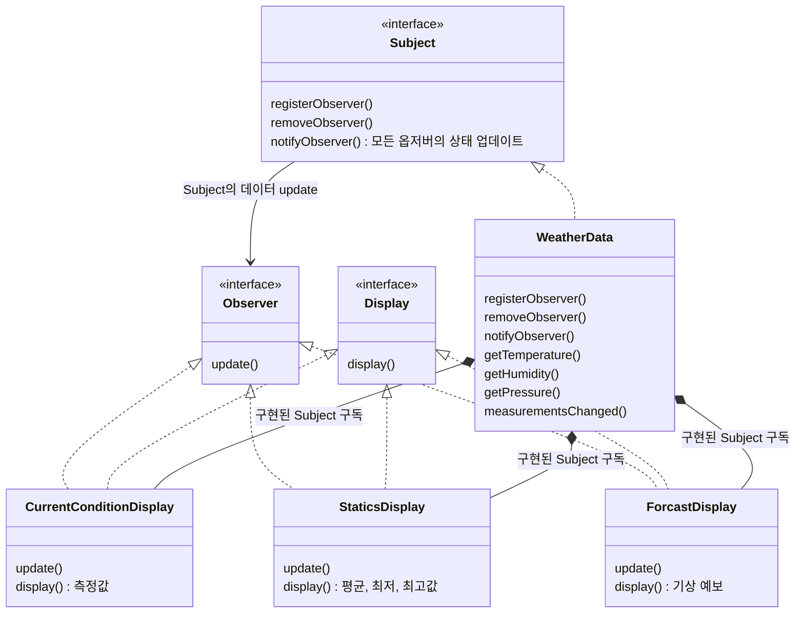

## 옵저버 패턴


### 옵저버 패턴이란

한 객체의 상태가 바뀌면 그 객체에 의존하는 다른 객체에게 연락이 가고 자동으로 내용이 갱신되는 방식으로 일대다(One To Many) 의존성을 정의한다.

> 일대다 관계는 느슨한 결합으로 구현한다.

<br>

### 클래스 다이어그램



<br>

### 구성 및 동작원리

#### 옵저버 등록

Subject에서 옵저버를 컨트롤 할 수 있도록 `registerObserver(Observer observer)` 메서드를 오버라이드하여 구현한다.

옵저버의 객체 생성 시, 생성자에 `Subject(WeahterData)`에 등록하여(리스트에 담아) 해당 옵저버가 Subject의 옵저버로 추가한다.

```java
// Subject 인터페이스 구현체
public class WeatherData implements Subject {

    private List<Observer> observers;
    private float temperature;
    private float humidity;
    private float pressure;

    // weather 데이터가 생성시 옵저버를 등록할 수 있도록 리스트 초기화
    public WeatherData() {
        this.observers = new ArrayList<>();
    }

    // 옵저버를 Subject에 등록하는 메서드
    @Override
    public void registerObserver(Observer observer) {
        this.observers.add(observer);
    }

    //..

}

// Observer 인터페이스 구현체
public class CurrentConditionDisplay implements Observer, Display {

    private float temperature;
    private float humidity;
    private WeatherData weatherData;
    
    public CurrentConditionDisplay(WeatherData weatherData) {
        this.weatherData = weatherData;
        weatherData.registerObserver(this);  // WeatherData(Subject)에 등록
    }

    // ...
}

```

#### Subject에 구독된 옵저버에게 메시지 전달

Subject를 상속받은 WeatherData는 Observer들에게 정보를 한번에 보내줘야한다. 

여기서는 `setMeasurements`를 호출하여 데이터를 저장하는 동시에 새로운 데이터를 모든 Observer들에게 보내주기위해
모든 옵저버들의 update 메서드를 호출한다.

```java
// WeatherData

public class WeatherData implements Subject {

    private List<Observer> observers;
    private float temperature;
    private float humidity;
    private float pressure;

    /*
        weather 데이터가 생성시 옵저버를 등록할 수 있도록 
            리스트 초기화
     */
    public WeatherData() {
        this.observers = new ArrayList<>();
    }

    // 옵저버 등록
    @Override
    public void registerObserver(Observer observer) {
        this.observers.add(observer);
    }

    /*
        기상 정보가 변경되면 모든 옵저버의 상태를 변경
    */
    @Override
    public void measurementsChanged() {
        this.notifyObservers();
    }

    public void setMeasurements(float temperature, float humidity, float pressure) {
        this.temperature = temperature;
        this.humidity = humidity;
        this.pressure = pressure;
        measurementsChanged();
    }

    @Override
    public void notifyObservers() {
        for (Observer observer : observers) {
            observer.update(this.temperature, this.humidity, this.pressure);
        }
    }

}
```

옵저버 인터페이스를 상속받은 옵저버 구현 글래스들은 update() 메서드를 해당하는 클래스의 기능별로 구현한다.

```java
// CurrentConditionDisplay
public class CurrentConditionDisplay implements Observer, Display {

    private float temperature;
    private float humidity;
    private WeatherData weatherData;
    
    public CurrentConditionDisplay(WeatherData weatherData) {
        this.weatherData = weatherData;
        weatherData.registerObserver(this);  // WeatherData(Subject)에 등록
    }

    /*
        update 호출시 기온, 습도를 변경하고 display를 호출한다.
     */
    @Override
    public void update(float temp, float humidity, float pressure) {
        this.temperature = temp;
        this.humidity = humidity;
        display();
    }

    @Override
    public void display() {
        System.out.println("temperature = " + temperature);
        System.out.println("humidity = " + humidity);
    }

}
```


#### 객체 생성

WeatherData(Subject) 생성하여 각 Observer들을 등록한다.

```java
// Executor

public class Executor {
    public static void main(String[] args) {
        // subject 객체 생성
        WeatherData weatherData = new WeatherData();

        // 옵저버 객체 생성 후 subject 객체를 인자로 전달
        CurrentConditionDisplay currentConditionDisplay = new CurrentConditionDisplay(weatherData);
        StaticDisplay staticDisplay = new StaticDisplay(weatherData);
        ForecastDisplay forecastDisplay = new ForecastDisplay(weatherData);

        // weatherData의 데이터를 변경하여 옵저버의 상태를 업데이트
        weatherData.setMeasurements(50, 80, 30.4f);
        weatherData.setMeasurements(60, 80, 29.4f);
        weatherData.setMeasurements(70, 65, 28.4f);
    }
}
```


### 풀 방식으로 변경하기

지금까지 옵저버 패턴은 Subject가 옵저버를 업데이트 하는 방식이었다면 옵저버가 필요할 때마다 Subject의 데이터를 폴링하는 방식으로도 변경할 수 있다.

1. 옵저버의 update() 메서드의 매개변수를 지워준다.
2. 옵저버 호출 시, 필드로 선언된 포함(Composition) 관계인 WeatherData 인터페이스의 get 메서드를 직접 호출하여 데이터를 받아온다.


```java
// Observer
public interface Observer {
    public void update();
}

// WeatherData
public class WeatherData implements Subject {

    //...

    public void notifyObservers() {
        for (Observer observer : observers) {
            observer.update()      
        }
    }

    //...

}

// CurrentConditionDisplay
public class CurrentConditionDisplay implements Observer, Display {

    WeatherData weatherData;

    // ...

    public void update() {
        this.temperature = weatherData.getTemperature();            
        this.humidity = weatherData.getHumidity();
        display();
    }

    // ...
}
```

---

출처 : [헤드 퍼스트 디자인 패턴](https://www.yes24.com/Product/Goods/108192370)
